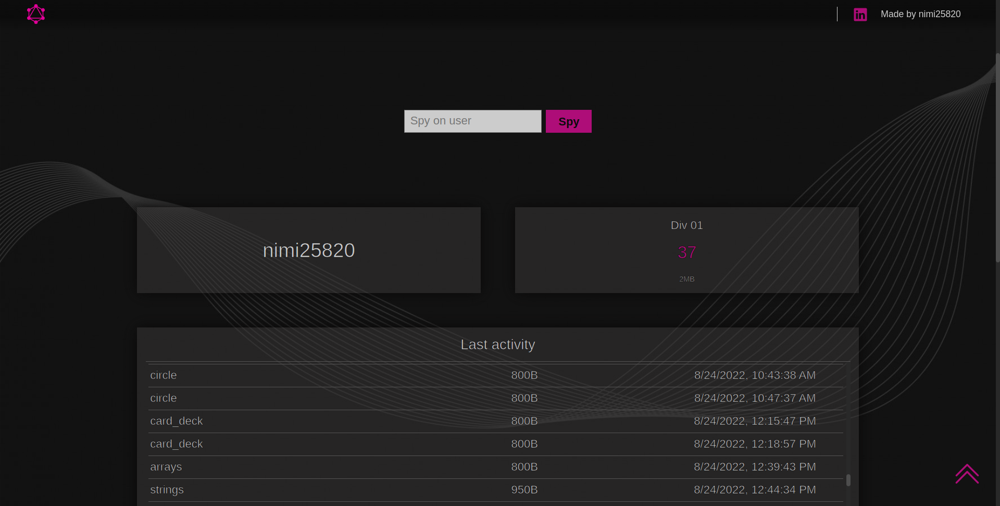

# graphql-charts

## Table of Contents
- [graphql-charts](#graphql-charts)
  - [Table of Contents](#table-of-contents)
  - [General Information](#general-information)
  - [Technologies Used](#technologies-used)
  - [Team \& My Work](#team--my-work)
  - [Main Learnings](#main-learnings)
  - [Setup](#setup)
  - [Images](#images)

## General Information
This project was made as a school project in [kood/Jõhvi](https://kood.tech/) (05.23.2022) 

I had to query a GraphQL endpoint set up by our school. Then I had to display the data using charts.

**NB! Different source control platform was used hence no commit history.**

## Technologies Used
- [JavaScript](https://www.javascript.com/)
- [Vue.js](https://vuejs.org/)
- [GraqphQL](https://graphql.org/)
- [Axios](https://axios-http.com/)
- [Bootstrap 5](https://getbootstrap.com/)
- [Express](https://expressjs.com/)

## Team & My Work
This project had to be done solo.

I had to write correct GraphQL queries and then display the data using Chart.js

**NB! Different source control platform was used hence no commit history.**

## Main Learnings
- Basics of GraphQL
- Basics of displaying data using Chart.js

## Setup
lone the repository
```
git clone https://github.com/JesusKris/graphql-charts.git
```
Navigate to ./client and install node modules
```
cd ./client && npm install
```
Start a dev server using Vite
```
npm run dev
```
## Images


